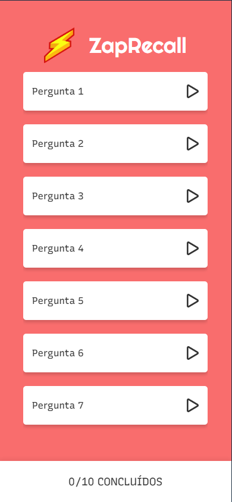

# Zap Recall ⚡

## O que é?

Zap Recall é um aplicativo de flashcards criado para turbinar seus estudos e revisões. Visualize a pergunta, tente lembrar a resposta e vire o cartão! Um "Zap!" ⚡ indica que o conteúdo está dominado. Ideal para identificar seus pontos fortes e fracos.

## Tecnologias

* **React:** Para uma interface de usuário dinâmica.
* **Vite:** Desenvolvimento rápido e eficiente.
* **Styled Components:** Estilos CSS dentro dos componentes React.

## Experimente!

[Link do Deploy no Vercel](https://zap-recall-beige-one.vercel.app)

## Demonstração

## Funcionalidades

* Flashcards interativos com perguntas e respostas.
* Simples mecânica de virar o cartão.
* Interface intuitiva.
* Perfeito para revisões rápidas e eficazes.

## Desenvolvedor

André Avelar